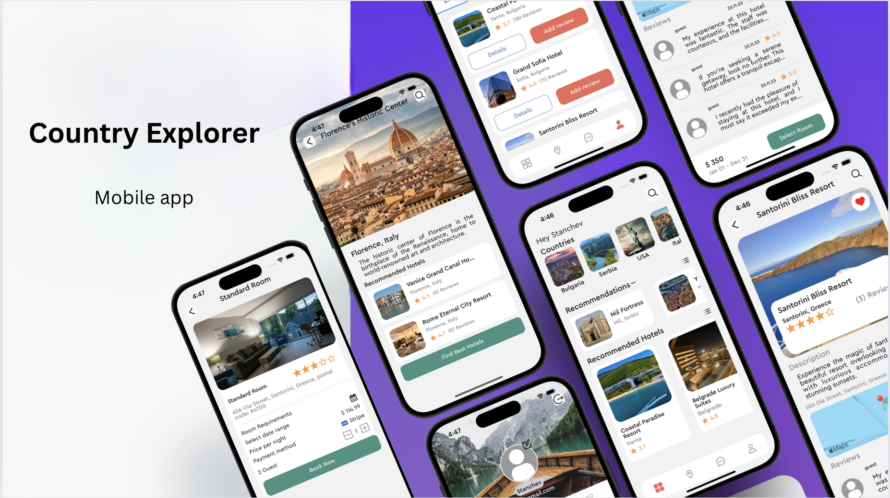
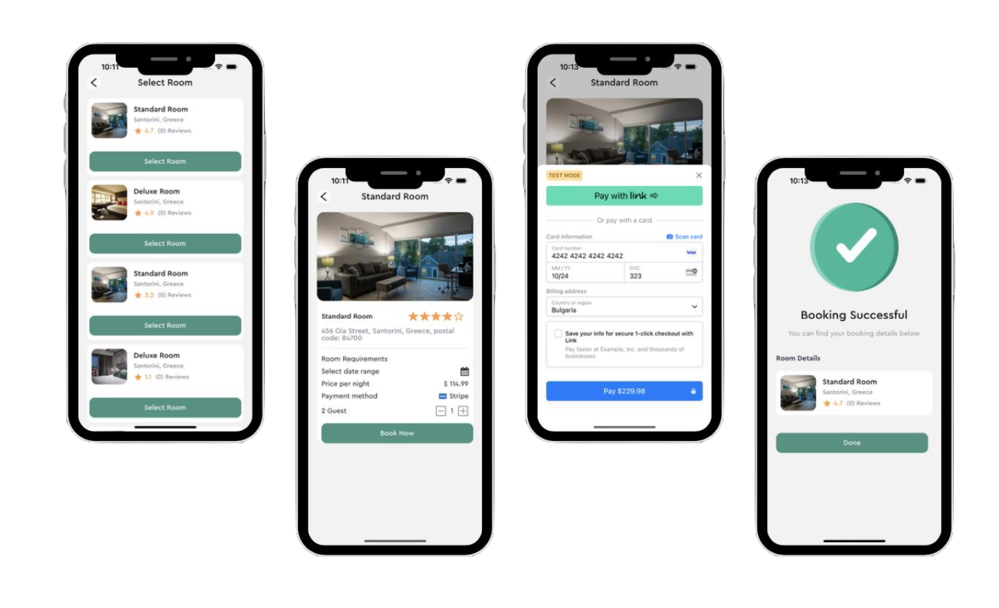
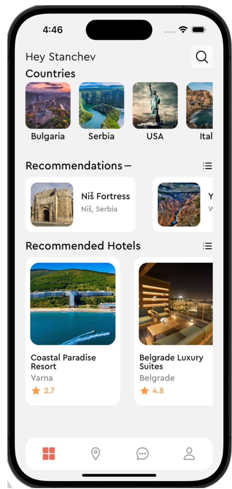
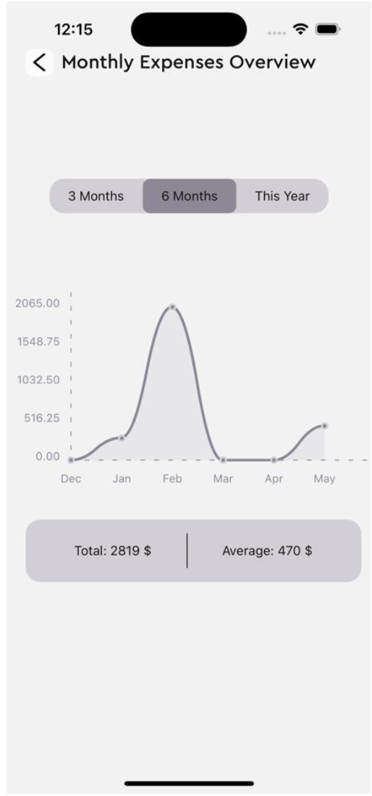
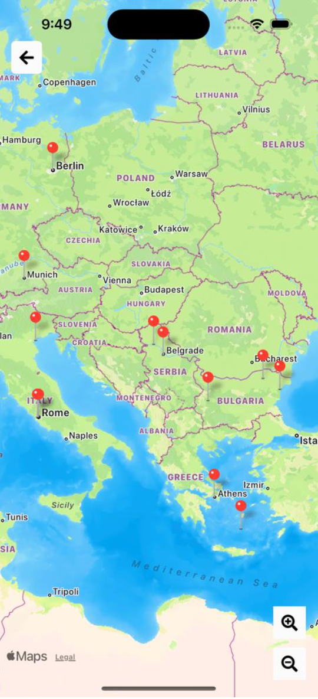
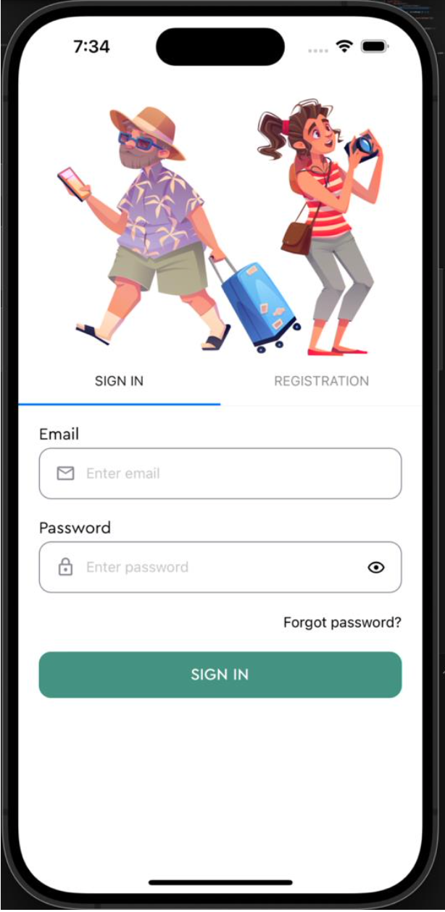
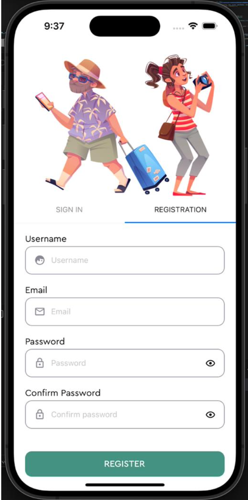
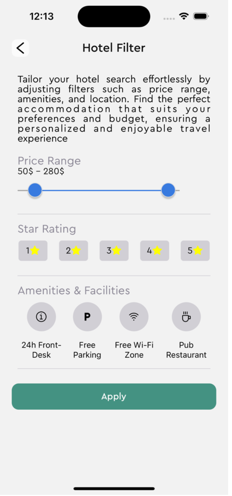

# 🌍 Country Explorer

Country Explorer is a mobile application built for both Android and iOS that provides users with detailed information about countries, places, and hotels. Users can create accounts, search for hotels and places, add hotels to their favorites list, and book hotel rooms. Additionally, users can view the pricing history of hotels over the last 3, 6 months, or 1 year.

## ✨ Features

- **🔐 User Authentication:** Create and manage user accounts.
- **🔑 Reset Password:** Reset your password if you forget it.
- **🔒 Forgot Password:** Recover your account with the forgot password feature.
- **🌏 Country Information:** Detailed information about various countries.
- **🏙️ Place Information:** Explore places connected to the countries.
- **🏨 Hotel Information:** Search for hotels and view their details.
- **🗂️ Filter Hotels:** Filter hotels by different criteria.
- **❤️ Favorites:** Add hotels to a favorites list.
- **🛏️ Booking:** Book hotel rooms directly through the app.
- **📊 Pricing History:** View historical price data for hotels over different periods.
- **📝 Reviews:** Add reviews to hotel bookings.

## 🛠️ Installation

Follow these steps to set up the project locally:

1. **Clone the repository:**

   ```bash
   git clone https://github.com/Stanislav001/TravelApplication.git
   cd TravelApplication
   ```

2. **Install dependencies:**

   ```bash
   npm install
   ```

3. **Install Expo CLI globally (if not already installed):**

   ```bash
   npm install -g expo-cli
   ```

4. **Start the development server:**

   ```bash
   npx expo start
   ```

## 🚀 Usage

### Running on Android/iOS:

Use the Expo Go app on your device to scan the QR code displayed in the terminal or on the Expo DevTools webpage.

### Running on an Emulator:

For Android, ensure you have an Android emulator running.
For iOS, ensure you have an iOS simulator running.

## 🛠️ Technologies Used

- **⚛️ React Native**
- **🛠️ Expo**
- **🌐 Axios for API calls**
- **📝 Formik and Yup for form handling and validation**
- **🧭 React Navigation for routing**
- **📊 Victory Native and React Native Chart Kit for data visualization**
- **🗺️ React Native Maps for displaying maps**

## ⚙️ Prerequisites

Make sure you have the following installed:

- **🟢 Node.js**
- **📦 npm or yarn**
- **📱 Expo CLI**
- **🤖 Android Studio (for Android development)**
- **🍎 Xcode (for iOS development)**

## Give a Star ⭐

If you find this project useful, please consider giving it a star! It helps to show appreciation for the effort put into this project.

## 📸 Screenshots











## Watch the Video

**[⬇️ Click here to watch the demo video](screenshots/travel-video.webm)**

---
